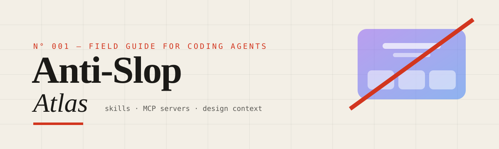

<p align="center">
  
</p>

<p align="center">
  <b>A curated map of skills, MCP servers and design context that stop Claude Code, Codex, Muse Code, Cursor, Copilot and every other coding agent from shipping AI-slop frontends.</b>
</p>

<p align="center">
  <a href="https://awesome.re"></a>
  <a href="LICENSE"></a>
  <a href="CONTRIBUTING.md"></a>
  
</p>

---

You know the look: a purple-to-blue gradient hero, Inter everywhere, a centered headline over three identical feature cards, untouched shadcn defaults, glassmorphism on everything, emoji instead of icons, and a "dark mode" that's really one big radial blob. Agents default to it because it's **the statistical average of the web.**

This atlas collects the tools that move agents off that average. There are four kinds:

| | Kind | What it changes |
| :-: | --- | --- |
| 🧭 | **Skills** | What the agent *decides*: taste, rules, critique loops |
| 🗺️ | **Design context** | What the agent *knows*: your tokens, brand and references |
| 🔌 | **MCP servers** | What the agent *can reach*: design canvases, real components, real apps |
| 👁️ | **Eyes** | What the agent *can see*: screenshots and audits of its own output |

> [!TIP]
> **In a hurry? Start with this stack:** one taste skill ([Impeccable](https://github.com/pbakaus/impeccable) or [Taste Skill](https://github.com/Leonxlnx/taste-skill)), a [DESIGN.md](https://github.com/google-labs-code/design.md) in your repo, and [Chrome DevTools MCP](https://github.com/ChromeDevTools/chrome-devtools-mcp) so the agent screenshots and critiques its own work before it hands the result to you.

## Contents

- [The slop tells](#the-slop-tells)
- [Anti-slop skills](#anti-slop-skills)
- [Official vendor skills](#official-vendor-skills)
- [Craft, motion & UX-canon skills](#craft-motion--ux-canon-skills)
- [Opinionated styles](#opinionated-styles)
- [Design lanes inside skill suites](#design-lanes-inside-skill-suites)
- [Design context: DESIGN.md, tokens & guidelines](#design-context-designmd-tokens--guidelines)
- [MCP: design canvases](#mcp-design-canvases)
- [MCP: references, motion & docs](#mcp-references-motion--docs)
- [MCP: component registries](#mcp-component-registries)
- [MCP: eyes on the output](#mcp-eyes-on-the-output)
- [Agent-native design tools](#agent-native-design-tools)
- [Per-agent install notes](#per-agent-install-notes)
- [Related lists](#related-lists)
- [Contributing](#contributing)

## The slop tells

Paste this into `CLAUDE.md`, `AGENTS.md`, `.cursor/rules` or your skill of choice. If a design has three or more of these and nobody chose them on purpose, it's slop.

| ✗ The tell | ✓ Do this instead |
| --- | --- |
| Purple/indigo → blue gradient as the "brand" | Pick one dominant color that fits the product, plus one sharp accent |
| Inter or the system sans for everything | Pair a display face that has character with a readable body face |
| Centered hero → 3 feature cards → testimonials → CTA | Build the layout around the content. Asymmetry is allowed |
| Untouched shadcn/ui (zinc, `rounded-lg`, soft shadow) | Set your own tokens *before* you add any components ([tweakcn](https://github.com/jnsahaj/tweakcn)) |
| Glassmorphism, glow blobs, radial "AI dark mode" | Flat surfaces with real contrast. Keep depth for things that need it |
| Emoji as icons | Use one consistent vector icon set, or none |
| Every card has the same padding, radius and shadow | Show hierarchy through spacing, weight and scale, not decoration |
| Fade-up-on-scroll everywhere, 400ms ease-in | Animate one or two meaningful moments, fast, with springs |
| "Unlock the power of…", "Seamless", "Revolutionize" | Say plainly what the product does |
| Vanity visuals (3D globes, fake dashboards, orbs) | Show the real product, or nothing |

## Anti-slop skills

Skills whose whole job is to give the agent taste, or to catch and fix output that doesn't have it.

<table>
<tr>
<td align="center" width="64"></td>
<td><a href="https://github.com/Leonxlnx/taste-skill"><b>Taste Skill</b></a><br><sub>A family of taste variants (minimalist, brutalist, soft and more) plus redesign audits and image skills. Three tunable dials act like an equalizer on the output.</sub></td>
<td align="center" width="120"></td>
</tr>
<tr>
<td align="center" width="64"></td>
<td><a href="https://github.com/nextlevelbuilder/ui-ux-pro-max-skill"><b>UI/UX Pro Max</b></a><br><sub>A design-intelligence engine. It reasons about your product and generates a whole design system: style, palette by product category, and font pairings.</sub></td>
<td align="center" width="120"></td>
</tr>
<tr>
<td align="center" width="64"></td>
<td><a href="https://github.com/pbakaus/impeccable"><b>Impeccable</b></a><br><sub>A shared design vocabulary: <code>polish</code>, <code>audit</code>, <code>critique</code>, <code>distill</code>, <code>bolder</code>, <code>quieter</code>… Each command loads references on type, color, motion, space, interaction and UX writing.</sub></td>
<td align="center" width="120"></td>
</tr>
<tr>
<td align="center" width="64"></td>
<td><a href="https://github.com/Nutlope/hallmark"><b>Hallmark</b></a><br><sub>An anti-AI-slop design skill for Claude Code, Cursor and Codex. It refuses pixel-clones and paid templates.</sub></td>
<td align="center" width="120"></td>
</tr>
<tr>
<td align="center" width="64"></td>
<td><a href="https://github.com/Dammyjay93/interface-design"><b>interface-design</b></a><br><sub>Design engineering with memory: a persistent design-system file, a <code>design-review</code> for hierarchy and typography, and a <code>design-deslop</code> pass that strips generated-UI tells.</sub></td>
<td align="center" width="120"></td>
</tr>
<tr>
<td align="center" width="64"></td>
<td><a href="https://github.com/miqdadbadjuber/anti-slop"><b>anti-slop</b></a><br><sub>Rules that stop an agent from producing generic UI, copy and code.</sub></td>
<td align="center" width="120"></td>
</tr>
<tr>
<td align="center" width="64"></td>
<td><a href="https://github.com/github/awesome-copilot/tree/main/skills/anti-ui-slop"><b>anti-ui-slop</b></a><br><sub>GitHub's Copilot collection skill, with references and agent definitions. It also runs outside Copilot.</sub></td>
<td align="center" width="120"></td>
</tr>
<tr>
<td align="center" width="64"></td>
<td><a href="https://github.com/Laith0003/ux-skill"><b>UX-Skill</b></a><br><sub>A deterministic anti-slop <i>linter</i> with 152 rules, brand specs and an MCP server. It runs offline and never calls an LLM, so its checks are reproducible.</sub></td>
<td align="center" width="120"></td>
</tr>
<tr>
<td align="center" width="64"></td>
<td><a href="https://github.com/funboy322/avoid-ai-design"><b>avoid-ai-design</b></a><br><sub>Audits and scores UI that's already been generated, then rewrites the slop (purple gradients, Inter, default shadcn). The design twin of avoid-ai-writing.</sub></td>
<td align="center" width="120"></td>
</tr>
<tr>
<td align="center" width="64"></td>
<td><a href="https://github.com/Koomook/claude-frontend-skills"><b>claude-frontend-skills</b></a><br><sub>A Claude Code plugin that pushes toward bold, memorable interfaces and away from generic fonts, gradients and lifeless motion.</sub></td>
<td align="center" width="120"></td>
</tr>
<tr>
<td align="center" width="64"></td>
<td><a href="https://github.com/vipulgupta2048/codex-skills"><b>codex-skills</b></a><br><sub>Fixes the purple slop that Codex's stock frontend skill produces.</sub></td>
<td align="center" width="120"></td>
</tr>
<tr>
<td align="center" width="64"></td>
<td><a href="https://github.com/wwewtech/anti-slop-design"><b>anti-slop-design</b></a><br><sub>Strict rules: a 1-to-3 UX hierarchy, tactile micro-interactions, and a 7-axis quality check before any code is emitted.</sub></td>
<td align="center" width="120"></td>
</tr>
</table>

## Official vendor skills

From the teams that build the agents and platforms.

<table>
<tr>
<td align="center" width="64"></td>
<td><a href="https://github.com/anthropics/skills/tree/main/skills/frontend-design"><b>Anthropic · frontend-design</b></a><br><sub>The reference skill for distinctive, production-grade UI. It also ships as a <a href="https://github.com/anthropics/claude-code/tree/main/plugins/frontend-design">Claude Code plugin</a>.</sub></td>
<td align="center" width="120"></td>
</tr>
<tr>
<td align="center" width="64"></td>
<td><a href="https://github.com/anthropics/skills/tree/main/skills"><b>Anthropic · theme-factory & web-artifacts-builder</b></a><br><sub>Theme presets you apply on purpose, and a React + Tailwind + shadcn builder for multi-component artifacts.</sub></td>
<td align="center" width="120"></td>
</tr>
<tr>
<td align="center" width="64"></td>
<td><a href="https://github.com/anthropics/claude-cookbooks/blob/main/coding/prompting_for_frontend_aesthetics.ipynb"><b>Anthropic · Prompting for frontend aesthetics</b></a><br><sub>The cookbook behind the skill: how to steer typography, color, motion and backgrounds away from the median.</sub></td>
<td align="center" width="120"></td>
</tr>
<tr>
<td align="center" width="64"></td>
<td><a href="https://dev.meta.ai/resources/blog/build-with-muse-code/"><b>Muse Code · /taste & /grilling</b></a><br><sub>Muse Code's bundled <code>/taste</code> is a flat checklist of visual defaults <i>not</i> to use. <code>/grilling</code> asks one decision-forcing question at a time until the design holds up.</sub></td>
<td align="center" width="120"><sub><b>Built in</b></sub></td>
</tr>
<tr>
<td align="center" width="64"></td>
<td><a href="https://github.com/vercel-labs/agent-skills/tree/main/skills/web-design-guidelines"><b>Vercel · web-design-guidelines</b></a><br><sub>Reviews UI code against Vercel's Web Interface Guidelines and reports findings as <code>file:line</code>. The same repo has <code>react-view-transitions</code> and <code>composition-patterns</code>.</sub></td>
<td align="center" width="120"></td>
</tr>
<tr>
<td align="center" width="64"></td>
<td><a href="https://github.com/openai/skills/tree/main/skills/.curated"><b>OpenAI · curated Codex skills</b></a><br><sub><code>figma-implement-design</code>, <code>figma-create-design-system-rules</code>, <code>figma-generate-library</code>, <code>playwright</code> and <code>screenshot</code>. Moving to <a href="https://github.com/openai/plugins">openai/plugins</a>.</sub></td>
<td align="center" width="120"></td>
</tr>
<tr>
<td align="center" width="64"></td>
<td><a href="https://github.com/google-labs-code/stitch-skills"><b>Google · Stitch skills</b></a><br><sub>Agent Skills (open standard) that pair with the Stitch MCP server for design-to-code.</sub></td>
<td align="center" width="120"></td>
</tr>
</table>

## Craft, motion & UX-canon skills

Not anti-slop filters. These teach the agent the details that separate designed from generated.

<table>
<tr>
<td align="center" width="64"></td>
<td><a href="https://github.com/emilkowalski/skills"><b>Emil Kowalski · skills</b></a><br><sub>Animation and interaction craft from the author of Sonner and Vaul.</sub></td>
<td align="center" width="120"></td>
</tr>
<tr>
<td align="center" width="64"></td>
<td><a href="https://github.com/jakubkrehel/make-interfaces-feel-better"><b>make-interfaces-feel-better</b></a><br><sub>The small details that make an interface feel right, not just look right.</sub></td>
<td align="center" width="120"></td>
</tr>
<tr>
<td align="center" width="64"></td>
<td><a href="https://github.com/kylezantos/design-motion-principles"><b>design-motion-principles</b></a><br><sub>Two modes: build components with purposeful motion, or audit the animations you have. It fixes "fade-up on everything."</sub></td>
<td align="center" width="120"></td>
</tr>
<tr>
<td align="center" width="64"></td>
<td><a href="https://github.com/ibelick/ui-skills"><b>UI Skills</b></a><br><sub>Skills for design engineers, browsable at ui-skills.com.</sub></td>
<td align="center" width="120"></td>
</tr>
<tr>
<td align="center" width="64"></td>
<td><a href="https://github.com/addyosmani/web-quality-skills"><b>web-quality-skills</b></a><br><sub>Lighthouse and Core Web Vitals skills. Slop is also slow, layout-shifting UI.</sub></td>
<td align="center" width="120"></td>
</tr>
<tr>
<td align="center" width="64"></td>
<td><a href="https://github.com/wondelai/skills"><b>Refactoring UI & friends (wondel.ai)</b></a><br><sub>Book-based skills: <code>refactoring-ui</code>, <code>design-everyday-things</code>, <code>hooked-ux</code>, <code>lean-ux</code>, <code>ios-hig-design</code>.</sub></td>
<td align="center" width="120"></td>
</tr>
</table>

## Opinionated styles

A committed aesthetic beats a timid average. Pick one on purpose.

<table>
<tr>
<td align="center" width="64"></td>
<td><a href="https://github.com/alchaincyf/huashu-design"><b>Huashu Design</b></a><br><sub>HTML-native prototypes, slides and animations, with 20 design philosophies and a 5-dimension review.</sub></td>
<td align="center" width="120"></td>
</tr>
<tr>
<td align="center" width="64"></td>
<td><a href="https://github.com/dominikmartn/nothing-design-skill"><b>Nothing Design Skill</b></a><br><sub>UI in the Nothing design language: monochrome, typographic, industrial.</sub></td>
<td align="center" width="120"></td>
</tr>
<tr>
<td align="center" width="64"></td>
<td><a href="https://github.com/bencium/bencium-marketplace"><b>Bencium UX designers</b></a><br><sub>Choose a temperament: <code>controlled-ux-designer</code>, <code>innovative-ux-designer</code> or <code>impact-designer</code>, plus <code>design-audit</code> and <code>typography</code>.</sub></td>
<td align="center" width="120"></td>
</tr>
</table>

## Design lanes inside skill suites

Bigger skill collections whose design tools are worth installing on their own.

<table>
<tr>
<td align="center" width="64"></td>
<td><a href="https://github.com/garrytan/gstack"><b>gstack</b></a><br><sub>Garry Tan's Claude Code setup. Its design lane includes <code>design-consultation</code>, <code>design-shotgun</code> (many directions at once), <code>design-review</code> and <code>plan-design-review</code>.</sub></td>
<td align="center" width="120"></td>
</tr>
<tr>
<td align="center" width="64"></td>
<td><a href="https://github.com/wshobson/agents/tree/main/plugins/ui-design"><b>wshobson/agents · ui-design</b></a><br><sub>A plugin with <code>visual-design-foundations</code>, <code>interaction-design</code>, <code>design-system-patterns</code>, <code>responsive-design</code> and accessibility skills. Works in Claude Code, Codex, Cursor and more.</sub></td>
<td align="center" width="120"></td>
</tr>
</table>

## Design context: DESIGN.md, tokens & guidelines

Agents fall back to slop when nobody has told them what the brand looks like. These give them that information.

<table>
<tr>
<td align="center" width="64"></td>
<td><a href="https://github.com/google-labs-code/design.md"><b>DESIGN.md</b></a><br><sub>A spec for describing a visual identity to agents, so they keep one persistent, structured picture of your design system.</sub></td>
<td align="center" width="120"></td>
</tr>
<tr>
<td align="center" width="64"></td>
<td><a href="https://github.com/VoltAgent/awesome-design-md"><b>awesome-design-md</b></a><br><sub>DESIGN.md files based on well-known brands' design systems. Add one to your project and the agent matches it.</sub></td>
<td align="center" width="120"></td>
</tr>
<tr>
<td align="center" width="64"></td>
<td><a href="https://github.com/rohitg00/awesome-claude-design"><b>awesome-claude-design</b></a><br><sub>DESIGN.md prompts grouped by aesthetic family, remix recipes and teardowns.</sub></td>
<td align="center" width="120"></td>
</tr>
<tr>
<td align="center" width="64"></td>
<td><a href="https://github.com/dembrandt/dembrandt"><b>Dembrandt</b></a><br><sub>Pulls any site's logo, colors, type and borders into tokens with one command.</sub></td>
<td align="center" width="120"></td>
</tr>
<tr>
<td align="center" width="64"></td>
<td><a href="https://github.com/jnsahaj/tweakcn"><b>tweakcn</b></a><br><sub>A visual theme editor for shadcn/ui. The fastest way to get off the default zinc look.</sub></td>
<td align="center" width="120"></td>
</tr>
<tr>
<td align="center" width="64"></td>
<td><a href="https://github.com/vercel-labs/web-interface-guidelines"><b>Web Interface Guidelines</b></a><br><sub>Vercel's rules for building web interfaces. Short enough to paste into a rules file.</sub></td>
<td align="center" width="120"></td>
</tr>
<tr>
<td align="center" width="64"></td>
<td><a href="https://github.com/raphaelsalaja/userinterface-wiki"><b>userinterface.wiki</b></a><br><sub>A living manual for better interfaces.</sub></td>
<td align="center" width="120"></td>
</tr>
</table>

## MCP: design canvases

Let the agent build from a real design, or draw one first, instead of guessing.

<table>
<tr>
<td align="center" width="64"></td>
<td><a href="https://help.figma.com/hc/en-us/articles/32132100833559-Guide-to-the-Figma-MCP-server"><b>Figma MCP server</b></a><br><sub>Official remote and desktop server: frames, variables, components, Code Connect. <a href="https://github.com/figma/mcp-server-guide">Usage guide</a>.</sub></td>
<td align="center" width="120"></td>
</tr>
<tr>
<td align="center" width="64"></td>
<td><a href="https://github.com/GLips/Figma-Context-MCP"><b>Framelink Figma MCP</b></a><br><sub>A community server that trims Figma layout data down to what an agent needs.</sub></td>
<td align="center" width="120"></td>
</tr>
<tr>
<td align="center" width="64"></td>
<td><a href="https://github.com/penpot/penpot-mcp"><b>Penpot MCP</b></a><br><sub>The official, two-way server for the open-source, self-hostable design tool.</sub></td>
<td align="center" width="120"></td>
</tr>
<tr>
<td align="center" width="64"></td>
<td><a href="https://paper.design/docs/mcp"><b>Paper MCP</b></a><br><sub>A design canvas built on real HTML and CSS. Agents create frames, set styles, take screenshots and read JSX or Tailwind for any node.</sub></td>
<td align="center" width="120"><sub><b>Hosted</b></sub></td>
</tr>
<tr>
<td align="center" width="64"></td>
<td><a href="https://docs.pencil.dev/getting-started/ai-integration"><b>pen.dev (Pencil) MCP</b></a><br><sub>Agents design and read <code>.pen</code> files next to your code. See also <a href="https://github.com/Nisus74/pencil-skill">pencil-skill</a>.</sub></td>
<td align="center" width="120"><sub><b>Local</b></sub></td>
</tr>
<tr>
<td align="center" width="64"></td>
<td><a href="https://stitch.withgoogle.com/docs/mcp/setup/"><b>Google Stitch MCP</b></a><br><sub>Generates UI designs from text and images, then brings screens into your repo. Community CLI: <a href="https://github.com/davideast/stitch-mcp">davideast/stitch-mcp</a>.</sub></td>
<td align="center" width="120"><sub><b>Hosted</b></sub></td>
</tr>
<tr>
<td align="center" width="64"></td>
<td><a href="https://www.framer.com/agents/external/"><b>Framer external agents</b></a><br><sub>A native connection for Claude Code, Cursor and Codex to your Framer canvas, components and CMS.</sub></td>
<td align="center" width="120"><sub><b>Hosted</b></sub></td>
</tr>
<tr>
<td align="center" width="64"></td>
<td><a href="https://www.canva.dev/docs/apps/mcp/"><b>Canva MCP</b></a><br><sub>The official remote server to generate, edit, search and export designs. OAuth, no API key.</sub></td>
<td align="center" width="120"><sub><b>Hosted</b></sub></td>
</tr>
<tr>
<td align="center" width="64"></td>
<td><a href="https://github.com/webflow/mcp-server"><b>Webflow MCP</b></a><br><sub>Reads and updates site structure and CMS through the Webflow Data API.</sub></td>
<td align="center" width="120"></td>
</tr>
</table>

## MCP: references, motion & docs

Real-world references and correct docs, so the agent isn't working from the average.

<table>
<tr>
<td align="center" width="64"></td>
<td><a href="https://mobbin.com/mcp"><b>Mobbin MCP</b></a><br><sub>600k+ screens from real shipped apps, so the agent references real products instead of the statistical average. <a href="https://github.com/mobbin/mobbin-mcp-server">Repo</a>.</sub></td>
<td align="center" width="120"><sub><b>Hosted</b></sub></td>
</tr>
<tr>
<td align="center" width="64"></td>
<td><a href="https://motion.dev/docs/ai-kit-install"><b>Motion AI Kit</b></a><br><sub>Motion's hosted MCP with up-to-date docs, so animations use real springs and not generic easing.</sub></td>
<td align="center" width="120"><sub><b>Hosted</b></sub></td>
</tr>
<tr>
<td align="center" width="64"></td>
<td><a href="https://github.com/upstash/context7"><b>Context7</b></a><br><sub>Version-correct docs for Tailwind, React and friends, which cuts down on hallucinated or outdated APIs.</sub></td>
<td align="center" width="120"></td>
</tr>
</table>

## MCP: component registries

Tested components, so the agent doesn't invent its own.

> [!WARNING]
> A registry makes your UI *consistent*. It doesn't make it *distinctive*. Set your own tokens first, or you'll ship default shadcn slop.

<table>
<tr>
<td align="center" width="64"></td>
<td><a href="https://ui.shadcn.com/docs/mcp"><b>shadcn/ui MCP</b></a><br><sub>The official server. Browse, search and install from any shadcn-compatible registry, including your own.</sub></td>
<td align="center" width="120"></td>
</tr>
<tr>
<td align="center" width="64"></td>
<td><a href="https://github.com/Jpisnice/shadcn-ui-mcp-server"><b>shadcn-ui-mcp-server</b></a><br><sub>Component structure and usage context for React, Svelte 5, Vue and React Native.</sub></td>
<td align="center" width="120"></td>
</tr>
<tr>
<td align="center" width="64"></td>
<td><a href="https://github.com/21st-dev/magic-mcp"><b>21st.dev MCP (formerly Magic)</b></a><br><sub>Search 10k+ community React/Tailwind components or generate new ones from your editor.</sub></td>
<td align="center" width="120"></td>
</tr>
<tr>
<td align="center" width="64"></td>
<td><a href="https://github.com/magicuidesign/mcp"><b>Magic UI MCP</b></a><br><sub>Magic UI's animated components, searchable and installable.</sub></td>
<td align="center" width="120"></td>
</tr>
<tr>
<td align="center" width="64"></td>
<td><a href="https://github.com/heroui-inc/heroui-mcp"><b>HeroUI MCP</b></a><br><sub>Servers for HeroUI React v3 and HeroUI Native.</sub></td>
<td align="center" width="120"></td>
</tr>
<tr>
<td align="center" width="64"></td>
<td><a href="https://storybook.js.org/docs/ai/mcp/overview"><b>Storybook MCP</b></a><br><sub>Shows agents your <i>own</i> components, stories and docs, so they reuse them instead of inventing new patterns. <code>npx storybook add @storybook/addon-mcp</code>.</sub></td>
<td align="center" width="120"></td>
</tr>
</table>

## MCP: eyes on the output

An agent that can't see its render can't tell that the render is slop. Close the loop with **screenshot → critique → revise**.

<table>
<tr>
<td align="center" width="64"></td>
<td><a href="https://github.com/ChromeDevTools/chrome-devtools-mcp"><b>Chrome DevTools MCP</b></a><br><sub>Drives a live Chrome: screenshots, performance traces, Lighthouse, console and network.</sub></td>
<td align="center" width="120"></td>
</tr>
<tr>
<td align="center" width="64"></td>
<td><a href="https://github.com/microsoft/playwright-mcp"><b>Playwright MCP</b></a><br><sub>Browser automation through accessibility snapshots. Good for checking responsive layouts and flows.</sub></td>
<td align="center" width="120"></td>
</tr>
<tr>
<td align="center" width="64"></td>
<td><a href="https://github.com/BrowserMCP/mcp"><b>Browser MCP</b></a><br><sub>Controls your real, logged-in browser through an extension.</sub></td>
<td align="center" width="120"></td>
</tr>
</table>

## Agent-native design tools

Open-source tools built around agents doing design.

<table>
<tr>
<td align="center" width="64"></td>
<td><a href="https://github.com/superdesigndev/superdesign"><b>SuperDesign</b></a><br><sub>An open-source product design agent inside your IDE. It generates many UI variations side by side before you commit to one.</sub></td>
<td align="center" width="120"></td>
</tr>
<tr>
<td align="center" width="64"></td>
<td><a href="https://github.com/onlook-dev/onlook"><b>Onlook</b></a><br><sub>A visual editor for your real React app: design in the browser, and AI writes the code.</sub></td>
<td align="center" width="120"></td>
</tr>
</table>

## Per-agent install notes

| Agent | Skills live in | MCP config |
| --- | --- | --- |
|  **Claude Code** | `~/.claude/skills/<name>/SKILL.md` or `.claude/skills/`; plugins via `/plugin` | `claude mcp add` |
|  **Codex CLI** | `~/.codex/skills/` or `.codex/skills/` | `~/.codex/config.toml` |
|  **Muse Code** | Bundled `/taste` and `/grilling` (explicit invocation only) | See Meta's docs |
|  **Cursor / Copilot / Gemini CLI / others** | Varies | Varies |

Most skills here follow the open `SKILL.md` format, so one skill usually works across agents. [`npx skills`](https://github.com/vercel-labs/skills) installs them into any supported agent:

```bash
npx skills add pbakaus/impeccable
```

## Related lists

- [VoltAgent/awesome-agent-skills](https://github.com/VoltAgent/awesome-agent-skills): 1000+ agent skills across agents.
- [ComposioHQ/awesome-claude-skills](https://github.com/ComposioHQ/awesome-claude-skills): Claude Skills, with a UI and frontend section.
- [travisvn/awesome-claude-skills](https://github.com/travisvn/awesome-claude-skills): Claude Skills and resources.
- [github/awesome-copilot](https://github.com/github/awesome-copilot): Copilot instructions, agents and skills.
- [anthropics/claude-plugins-official](https://github.com/anthropics/claude-plugins-official): Anthropic's plugin directory.
- [maxbogo/awesome-ai-tools-for-ui](https://github.com/maxbogo/awesome-ai-tools-for-ui): AI tools for UI/UX.

## Contributing

PRs are welcome. Read [CONTRIBUTING.md](CONTRIBUTING.md). One rule: every entry must say **how** it fights slop, not just that it's about design.

Logos are each project's site favicon or its GitHub owner avatar. Star badges update live.

## License

[CC0 1.0](LICENSE). Public domain, use it however you like.
